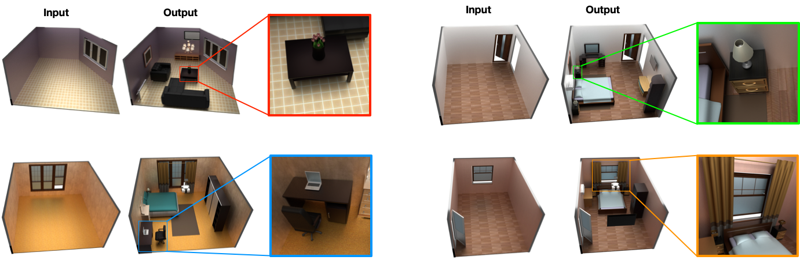

# SceneFormer: Indoor Scene Generation with Transformers



Initial code release for the [Sceneformer paper](https://arxiv.org/abs/2012.09793), contains models, train and test scripts for the shape conditioned model. Text conditioned model and detailed README coming soon.


Please also check the project website [here](https://xinpeng-wang.github.io/sceneformer/)
## Setup
Install the requirements in `requirements.txt` and `environment.yaml` in a conda environment. Packages that are common can be installed either through
pip or conda.

## Prepare Data
The SUNCG dataset is currently not available, hence all related files have been removed. The dataset can be prepared with the scripts which were taken  from [deepsynth](https://github.com/brownvc/deep-synth).

## Train
Configure the experiment in `configs/scene_shift_X_config.yaml` where `X` is one of `cat, dim, loc, ori`

Then run 
```
python scene_scripts/train_shift_X_lt.py configs/scene_shift_X_config.yaml
```
to train the model `X`.

## Test
Configure the model paths in `scene_scripts/test.py` and then run 
```
python scene_scripts/test.py
```


**If you find our work useful, please consider citing us:**

```
@article{wang2020sceneformer,
  title={SceneFormer: Indoor Scene Generation with Transformers},
  author={Wang, Xinpeng and Yeshwanth, Chandan and Nie{\ss}ner, Matthias},
  journal={arXiv preprint arXiv:2012.09793},
  year={2020}
}
```
